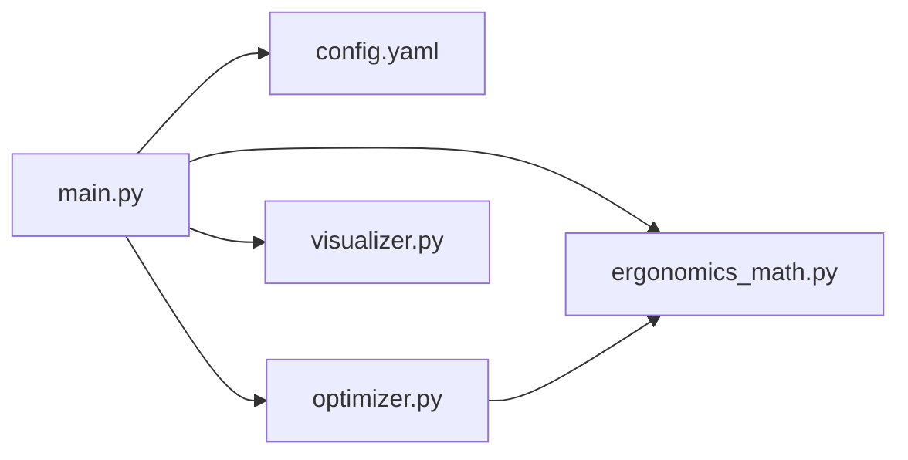

# Documento de Diseño Técnico

## Optimizador Ergonómico de Layouts 3D

---

## Visión General

El sistema es una aplicación Python de línea de comandos que calcula y optimiza la disposición espacial de herramientas industriales para minimizar la fatiga física de obreros. El flujo principal es:

1. Cargar configuración desde `config.yaml`
2. Calcular el costo de fatiga del layout inicial
3. Ejecutar optimización metaheurística
4. Generar visualización 3D interactiva en HTML

El sistema se estructura en tres módulos con responsabilidades estrictamente separadas:

- `ergonomics_math.py` — cálculo biomecánico puro (sin I/O, sin estado)
- `optimizer.py` — búsqueda metaheurística del layout óptimo
- `visualizer.py` — generación del gráfico 3D con Plotly
- `main.py` — punto de entrada CLI que orquesta los tres módulos
- `config.yaml` — configuración declarativa del problema



---

## Arquitectura

### Principios de diseño

- **Pureza funcional en el core biomecánico**: `ergonomics_math.py` contiene únicamente funciones puras sin efectos secundarios. Esto permite testeo exhaustivo con property-based testing.
- **Separación de I/O**: la carga de configuración y la escritura de archivos ocurren exclusivamente en `main.py`. Los módulos de cálculo y optimización no realizan I/O.
- **Reproducibilidad**: el optimizador acepta semilla aleatoria para garantizar resultados deterministas.
- **Penalización por infactibilidad**: las restricciones de colisión y alcance se manejan como penalizaciones en la función objetivo, no como restricciones duras, para compatibilidad con optimizadores de gradiente libre.

### Stack tecnológico

| Componente | Librería | Justificación |
|---|---|---|
| Optimización | `scipy.optimize.differential_evolution` | Metaheurístico clásico, gradiente libre, soporta bounds y seed |
| Visualización | `plotly` | Gráficos 3D interactivos, exportación HTML autocontenida |
| Configuración | `pyyaml` | Estándar para YAML en Python |
| Testing | `pytest` + `hypothesis` | Property-based testing nativo en Python |
| Validación numérica | `math.isfinite` | Verificación de valores reales finitos sin dependencias externas |

### Flujo de datos

```mermaid
sequenceDiagram
    participant CLI as main.py
    participant CFG as config_loader
    participant MATH as ergonomics_math
    participant OPT as optimizer
    participant VIZ as visualizer

    CLI->>CFG: load_config(path)
    CFG-->>CLI: Config object
    CLI->>MATH: total_fatigue_cost(initial_layout)
    MATH-->>CLI: initial_cost: float
    CLI->>OPT: optimize(config)
    OPT->>MATH: total_fatigue_cost(candidate) [N iteraciones]
    MATH-->>OPT: cost: float
    OPT-->>CLI: OptimizationResult
    CLI->>VIZ: render_comparison(initial, optimized, output_path)
    VIZ-->>CLI: HTML file written
```

---

## Componentes e Interfaces

### `ergonomics_math.py`

Módulo de funciones puras. No importa ningún módulo del proyecto.

```python
def euclidean_distance(pos_a: tuple[float, float, float],
                       pos_b: tuple[float, float, float]) -> float:
    """Distancia euclidiana entre dos puntos 3D."""

def power_zone_penalty(z: float,
                       z_min: float = 0.8,
                       z_max: float = 1.2) -> float:
    """Penalización aditiva por desviación de la Power Zone.
    Retorna 0.0 si z está dentro del rango [z_min, z_max].
    Retorna la desviación absoluta al límite más cercano en caso contrario."""

def tool_fatigue_cost(x: float, y: float, z: float,
                      weight_kg: float,
                      worker_ref: tuple[float, float, float],
                      z_min: float = 0.8,
                      z_max: float = 1.2) -> float:
    """Costo de fatiga de una herramienta individual.
    = euclidean_distance(pos, worker_ref) * weight_kg + power_zone_penalty(z)
    Lanza ValueError si weight_kg <= 0 o si alguna coordenada no es finita."""

def total_fatigue_cost(layout: Iterable[tuple[float, float, float, float]],
                       worker_ref: tuple[float, float, float],
                       z_min: float = 0.8,
                       z_max: float = 1.2) -> float:
    """Suma de costos individuales de todas las herramientas.
    layout: iterable de (x, y, z, weight_kg)
    Lanza ValueError si el layout está vacío."""

def check_separation_constraints(layout: Iterable[tuple[float, float, float, float]],
                                  min_separation: float) -> bool:
    """Retorna True si todas las distancias entre pares de herramientas
    son >= min_separation. Retorna False en caso contrario."""
```

### `optimizer.py`

```python
@dataclass
class OptimizationResult:
    layout: list[dict]   # [{"name": str, "x": float, "y": float, "z": float, "weight_kg": float}]
    cost: float
    converged: bool

def optimize(config: Config,
             random_seed: int | None = None,
             max_iterations: int = 1000) -> OptimizationResult:
    """Ejecuta differential_evolution de scipy para minimizar total_fatigue_cost.
    Aplica penalización por colisión y por exceso de radio de alcance.
    Retorna el mejor resultado encontrado aunque no haya convergencia."""
```

La función objetivo interna construye el vector de posiciones, calcula `total_fatigue_cost` y suma penalizaciones:

```python
def _objective(x_flat, tools, worker_ref, workspace, z_min, z_max,
               min_separation, reach_radius, penalty_factor=1e6):
    # x_flat: vector 1D de longitud 3*N (x0,y0,z0, x1,y1,z1, ...)
    layout = [(x_flat[3*i], x_flat[3*i+1], x_flat[3*i+2], tools[i].weight_kg)
              for i in range(len(tools))]
    cost = total_fatigue_cost(layout, worker_ref)
    # Penalización por colisión
    if not check_separation_constraints(layout, min_separation):
        cost += penalty_factor * violation_magnitude(layout, min_separation)
    # Penalización por alcance
    for pos in layout:
        d = euclidean_distance(pos[:3], worker_ref)
        if d > reach_radius:
            cost += penalty_factor * (d - reach_radius)
    return cost
```

### `visualizer.py`

```python
def render_layout(layout: list[dict],
                  worker_ref: dict,
                  fatigue_cost: float,
                  output_path: str,
                  z_min: float = 0.8,
                  z_max: float = 1.2) -> None:
    """Genera gráfico 3D con Plotly y exporta HTML autocontenido.
    Lanza ValueError si layout está vacío."""

def render_comparison(initial_layout: list[dict],
                      optimized_layout: list[dict],
                      worker_ref: dict,
                      initial_cost: float,
                      optimized_cost: float,
                      output_path: str,
                      z_min: float = 0.8,
                      z_max: float = 1.2) -> None:
    """Renderiza ambos layouts en el mismo gráfico con trazas diferenciadas."""
```

### `config_loader.py`

```python
@dataclass
class ToolConfig:
    name: str
    weight_kg: float
    initial_position: tuple[float, float, float]

@dataclass
class WorkspaceConfig:
    x_min: float; x_max: float
    y_min: float; y_max: float
    z_min: float; z_max: float
    reach_radius: float
    min_separation: float

@dataclass
class Config:
    workspace: WorkspaceConfig
    worker_reference: tuple[float, float, float]
    tools: list[ToolConfig]

def load_config(path: str) -> Config:
    """Carga y valida config.yaml. Lanza FileNotFoundError o ValueError según corresponda."""
```

### `main.py`

```python
def main() -> int:
    """Punto de entrada CLI. Retorna 0 en éxito, 1 en error."""
    # argparse: config_path (obligatorio), --output, --seed
    # Secuencia: load_config → total_fatigue_cost(inicial) → optimize → render_comparison
    # Imprime: costo inicial, costo optimizado, % mejora
```

---

## Modelos de Datos

### Representación interna del layout

El core biomecánico usa tuplas `(x, y, z, weight_kg)` para mantener independencia de representación y facilitar el testing funcional.

El optimizador trabaja internamente con un vector plano `float[]` de longitud `3*N` (solo coordenadas, los pesos son constantes del problema).

El resultado del optimizador y la visualización usan `list[dict]` con campos `name`, `x`, `y`, `z`, `weight_kg` para legibilidad.

### Esquema `config.yaml`

```yaml
workspace:
  x_min: 0.0
  x_max: 2.0
  y_min: 0.0
  y_max: 2.0
  z_min: 0.0
  z_max: 2.0
  reach_radius: 1.5
  min_separation: 0.2

worker_reference:
  x: 0.0
  y: 0.0
  z: 1.0

tools:
  - name: "Llave inglesa"
    weight_kg: 1.2
    initial_position:
      x: 0.5
      y: 0.5
      z: 0.5
  - name: "Destornillador"
    weight_kg: 0.3
    initial_position:
      x: 1.0
      y: 0.5
      z: 1.0
```

### Tipos de datos clave

| Concepto | Tipo Python | Notas |
|---|---|---|
| Posición 3D | `tuple[float, float, float]` | (x, y, z) |
| Herramienta en layout interno | `tuple[float, float, float, float]` | (x, y, z, weight_kg) |
| Herramienta en resultado | `dict` | name, x, y, z, weight_kg |
| Costo de fatiga | `float` | >= 0.0 |
| Layout completo (core) | `Iterable[tuple[float,float,float,float]]` | orden no importa |

---


## Propiedades de Corrección

*Una propiedad es una característica o comportamiento que debe mantenerse verdadero en todas las ejecuciones válidas del sistema — esencialmente, una declaración formal sobre lo que el sistema debe hacer. Las propiedades sirven como puente entre las especificaciones legibles por humanos y las garantías de corrección verificables por máquina.*

El core biomecánico (`ergonomics_math.py`) es un conjunto de funciones puras con espacio de entrada continuo y propiedades matemáticas bien definidas, lo que lo hace ideal para property-based testing. El optimizador produce resultados que deben satisfacer invariantes universales independientemente de la configuración de entrada.

---

### Propiedad 1: No negatividad del costo de fatiga

*Para cualquier* combinación de coordenadas XYZ dentro del espacio de trabajo y peso positivo, el costo de fatiga individual y el costo total del layout deben ser mayores o iguales a cero.

**Valida: Requisitos 1.4, 2.2, 9.1**

---

### Propiedad 2: Penalización de Power Zone

*Para cualquier* valor de coordenada Z, la penalización de Power Zone debe ser exactamente cero cuando Z está en el intervalo [0.8, 1.2], y estrictamente positiva e igual a la desviación absoluta al límite más cercano cuando Z está fuera de ese intervalo.

**Valida: Requisitos 1.2**

---

### Propiedad 3: Linealidad del costo por peso

*Para cualquier* posición XYZ fija y cualquier peso positivo `w`, el costo de fatiga de la herramienta con peso `2w` debe ser igual al doble del costo con peso `w` más la diferencia de penalizaciones de Power Zone (que es cero si Z no cambia).

Más precisamente: `tool_fatigue_cost(x, y, z, 2w) = 2 * tool_fatigue_cost(x, y, z, w)` cuando la penalización de Power Zone es cero (Z en [0.8, 1.2]).

**Valida: Requisitos 1.3**

---

### Propiedad 4: Invarianza al orden del layout

*Para cualquier* layout no vacío de herramientas, el costo de fatiga total debe ser idéntico independientemente del orden en que se listen las herramientas en el iterable.

**Valida: Requisitos 2.1, 9.6**

---

### Propiedad 5: Rechazo de inputs inválidos

*Para cualquier* peso menor o igual a cero, `tool_fatigue_cost` debe lanzar `ValueError`. *Para cualquier* coordenada que no sea un número real finito (inf, -inf, nan), `tool_fatigue_cost` debe lanzar `ValueError`.

**Valida: Requisitos 1.5, 1.6**

---

### Propiedad 6: Correctitud de check_separation_constraints

*Para cualquier* layout de herramientas y valor de `min_separation`, `check_separation_constraints` debe retornar `True` si y solo si la distancia euclidiana entre todo par de herramientas es mayor o igual a `min_separation`.

**Valida: Requisitos 5.2**

---

### Propiedad 7: Bounds del resultado del optimizador

*Para cualquier* configuración válida, todas las coordenadas XYZ de cada herramienta en el layout optimizado deben estar dentro de los límites del espacio de trabajo definidos en la configuración.

**Valida: Requisitos 4.2, 9.3**

---

### Propiedad 8: Separación en el resultado del optimizador

*Para cualquier* configuración válida, la distancia euclidiana entre cualquier par de herramientas en el layout optimizado debe ser mayor o igual al `min_separation` definido en la configuración.

**Valida: Requisitos 4.3, 5.1, 9.2**

---

### Propiedad 9: Mejora monotónica del optimizador

*Para cualquier* configuración válida con un layout inicial factible, el costo de fatiga del layout optimizado debe ser menor o igual al costo de fatiga del layout inicial.

**Valida: Requisitos 4.1, 9.4**

---

### Propiedad 10: Idempotencia del optimizador

*Para cualquier* configuración válida, ejecutar el optimizador sobre el layout ya optimizado (usándolo como posición inicial) no debe producir un costo de fatiga mayor al del layout optimizado original.

**Valida: Requisitos 9.5**

---

### Propiedad 11: Optimalidad de la Power Zone

*Para cualquier* herramienta con coordenadas X e Y fijas, peso positivo y coordenada Z fuera del intervalo [0.8, 1.2], el costo de fatiga con Z = 1.0 (centro de la Power Zone) debe ser estrictamente menor que el costo con la Z original.

**Valida: Requisitos 9.7**

---

### Propiedad 12: Contenido del HTML de visualización

*Para cualquier* layout no vacío de herramientas, el archivo HTML generado por `render_layout` debe contener el nombre de cada herramienta y el valor del costo de fatiga total en el título.

**Valida: Requisitos 6.1, 6.7**

---

## Manejo de Errores

### Estrategia general

El sistema usa excepciones estándar de Python con mensajes descriptivos. No se usan códigos de error numéricos. Los errores se propagan hacia `main.py`, que los captura, los imprime en `stderr` y retorna código de salida `1`.

### Tabla de errores por módulo

| Módulo | Condición | Excepción | Mensaje |
|---|---|---|---|
| `ergonomics_math` | `weight_kg <= 0` | `ValueError` | `"El peso debe ser positivo, se recibió: {weight_kg}"` |
| `ergonomics_math` | Coordenada no finita | `ValueError` | `"Las coordenadas deben ser números reales finitos, se recibió: x={x}, y={y}, z={z}"` |
| `ergonomics_math` | Layout vacío | `ValueError` | `"El layout no puede estar vacío"` |
| `config_loader` | Archivo no existe | `FileNotFoundError` | `"No se encontró el archivo de configuración: {path}"` |
| `config_loader` | Campo obligatorio ausente | `ValueError` | `"Campos inválidos o ausentes en la configuración: {lista_de_campos}"` |
| `config_loader` | Peso de herramienta <= 0 | `ValueError` | `"El peso de la herramienta '{name}' debe ser positivo, se recibió: {weight_kg}"` |
| `visualizer` | Layout vacío | `ValueError` | `"No se puede visualizar un layout vacío"` |
| `optimizer` | No convergencia | Advertencia en consola | `"ADVERTENCIA: El optimizador no convergió en {max_iter} iteraciones. Se retorna el mejor resultado encontrado."` |
| `config_loader` | Coordenadas iniciales fuera de bounds | Advertencia en consola | `"ADVERTENCIA: La herramienta '{name}' tiene coordenadas iniciales fuera del espacio de trabajo. El optimizador corregirá la posición."` |

### Flujo de error en `main.py`

```python
try:
    config = load_config(args.config)
    initial_cost = total_fatigue_cost(initial_layout, worker_ref)
    result = optimize(config, random_seed=args.seed)
    render_comparison(...)
    print(f"Costo inicial: {initial_cost:.4f}")
    print(f"Costo optimizado: {result.cost:.4f}")
    print(f"Mejora: {improvement:.1f}%")
    return 0
except (FileNotFoundError, ValueError) as e:
    print(f"Error: {e}", file=sys.stderr)
    return 1
except Exception as e:
    print(f"Error inesperado: {e}", file=sys.stderr)
    return 1
```

---

## Estrategia de Testing

### Enfoque dual

El proyecto usa dos tipos de tests complementarios:

1. **Tests de propiedad** (`hypothesis`): verifican invariantes universales del core biomecánico y del optimizador con cientos de inputs generados aleatoriamente.
2. **Tests de ejemplo** (`pytest`): verifican comportamientos específicos, casos de error y la integración entre módulos.

### Librería de property-based testing

Se usa **Hypothesis** (Python), la librería estándar de PBT para Python. Cada test de propiedad se configura con `@settings(max_examples=100)` como mínimo.

### Estructura de archivos de test

```
tests/
├── test_ergonomics_math.py    # Tests de propiedad + ejemplos del core biomecánico
├── test_optimizer.py          # Tests de propiedad del optimizador
├── test_visualizer.py         # Tests de ejemplo del visualizador
├── test_config_loader.py      # Tests de ejemplo del cargador de configuración
└── test_integration.py        # Tests de integración end-to-end
```

### Tests de propiedad (Hypothesis)

Cada test de propiedad implementa exactamente una propiedad del documento de diseño y se etiqueta con un comentario de referencia.

```python
# Feature: ergonomic-layout-optimizer, Propiedad 1: No negatividad del costo de fatiga
@given(
    x=st.floats(min_value=0.0, max_value=2.0, allow_nan=False, allow_infinity=False),
    y=st.floats(min_value=0.0, max_value=2.0, allow_nan=False, allow_infinity=False),
    z=st.floats(min_value=0.0, max_value=2.0, allow_nan=False, allow_infinity=False),
    weight=st.floats(min_value=0.001, max_value=50.0, allow_nan=False, allow_infinity=False)
)
@settings(max_examples=200)
def test_fatigue_cost_non_negative(x, y, z, weight):
    cost = tool_fatigue_cost(x, y, z, weight, worker_ref=(0.0, 0.0, 1.0))
    assert cost >= 0.0
```

### Cobertura de propiedades en tests

| Propiedad | Archivo | Tipo |
|---|---|---|
| P1: No negatividad | `test_ergonomics_math.py` | Hypothesis |
| P2: Penalización Power Zone | `test_ergonomics_math.py` | Hypothesis |
| P3: Linealidad por peso | `test_ergonomics_math.py` | Hypothesis |
| P4: Invarianza al orden | `test_ergonomics_math.py` | Hypothesis |
| P5: Rechazo de inputs inválidos | `test_ergonomics_math.py` | Hypothesis |
| P6: check_separation_constraints | `test_ergonomics_math.py` | Hypothesis |
| P7: Bounds del optimizador | `test_optimizer.py` | Hypothesis |
| P8: Separación en resultado | `test_optimizer.py` | Hypothesis |
| P9: Mejora monotónica | `test_optimizer.py` | Hypothesis |
| P10: Idempotencia | `test_optimizer.py` | Hypothesis |
| P11: Optimalidad Power Zone | `test_ergonomics_math.py` | Hypothesis |
| P12: Contenido HTML | `test_visualizer.py` | Hypothesis |

### Tests de ejemplo

- Carga de `config.yaml` válido e inválido (campos faltantes, tipos incorrectos, archivo inexistente)
- Layout vacío lanza `ValueError` en `total_fatigue_cost` y `render_layout`
- CLI retorna código 0 en éxito y código 1 en error
- Advertencia en consola cuando coordenadas iniciales están fuera de bounds
- Advertencia en consola cuando el optimizador no converge

### Configuración de Hypothesis

```python
# conftest.py
from hypothesis import settings, HealthCheck

settings.register_profile("ci", max_examples=200, suppress_health_check=[HealthCheck.too_slow])
settings.register_profile("dev", max_examples=50)
settings.load_profile("ci")
```

### Nota sobre los tests del optimizador

Los tests de propiedad del optimizador (P7, P8, P9, P10) usan configuraciones pequeñas (2-3 herramientas) y un número reducido de iteraciones del optimizador para mantener tiempos de ejecución razonables. La semilla aleatoria fija garantiza determinismo en CI.
